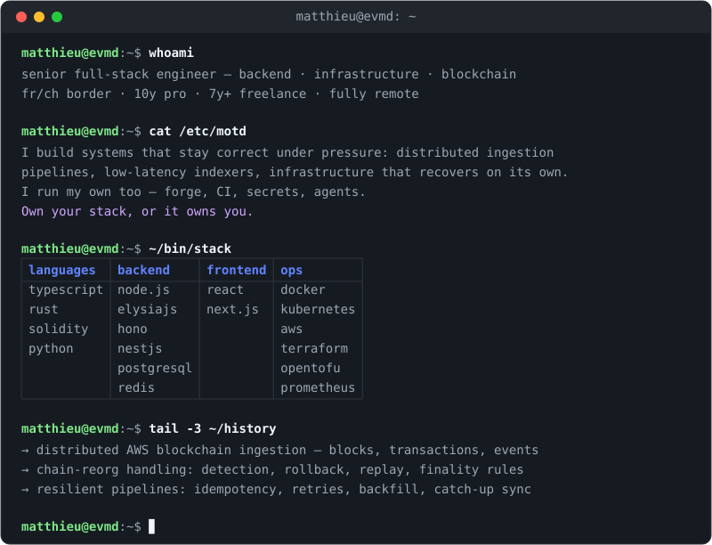

  

  currently hacking → <a href="https://github.com/evmd/docker-firefox-fido2">docker-firefox-fido2</a>

  <a href="https://matthieuguerra.com">site</a> ·
  <a href="https://www.linkedin.com/in/matthieu-guerra/">linkedin</a> ·
  <a href="mailto:contact@matthieuguerra.com">contact@matthieuguerra.com</a>

<!-- Edit profile.yaml, then regenerate the banner: ./gen-terminal.py (needs pyyaml) -->
